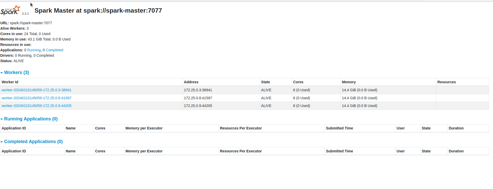
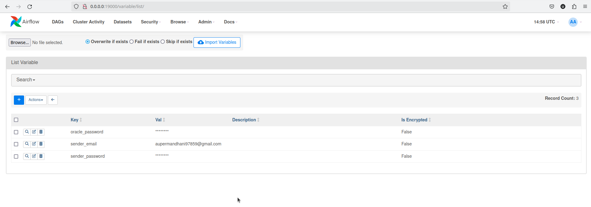
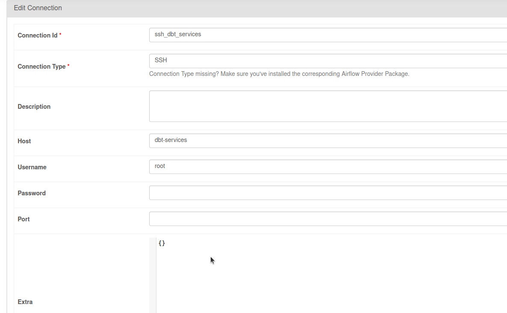
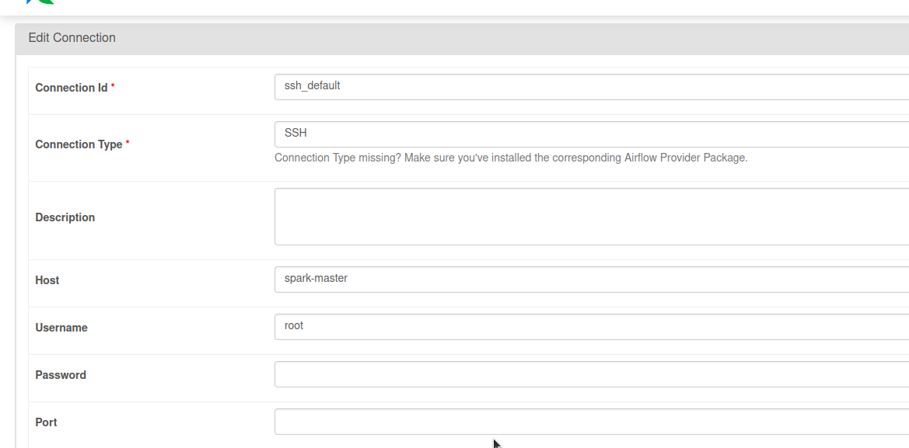
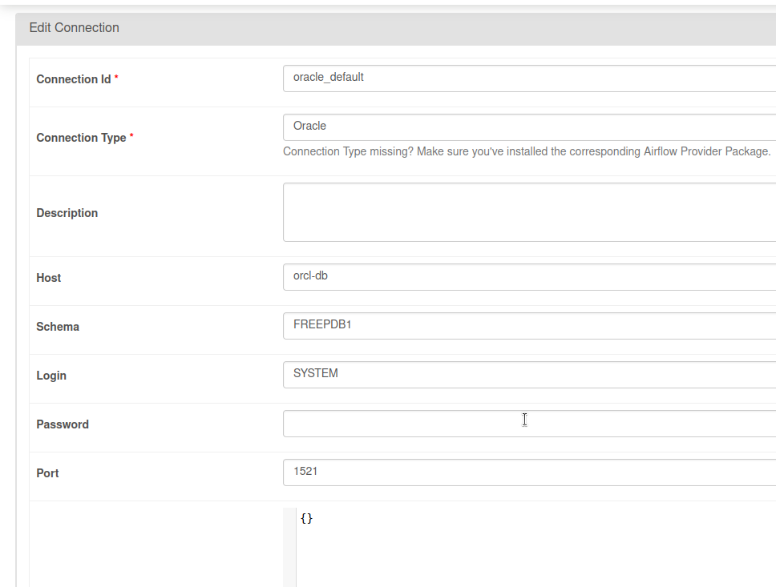

### How To?

### prerequisites

* docker 
* docker-compose 

### Commands 

```bash
docker-compose build 
docker-compose up -d
```

#### URLS
Airflow url - http://0.0.0.0:19000/home
Spark-cluster - 

#### Screen shots 

**Airflow UI**


**Spark UI**


**Variable list**


**Connection list**
###### dbt-container ssh connection 



###### spark-master ssh connection 



###### oracle db ssh connection 


